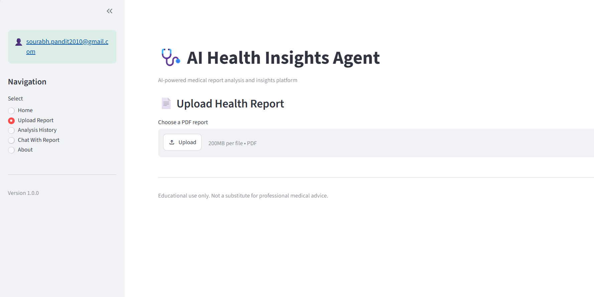
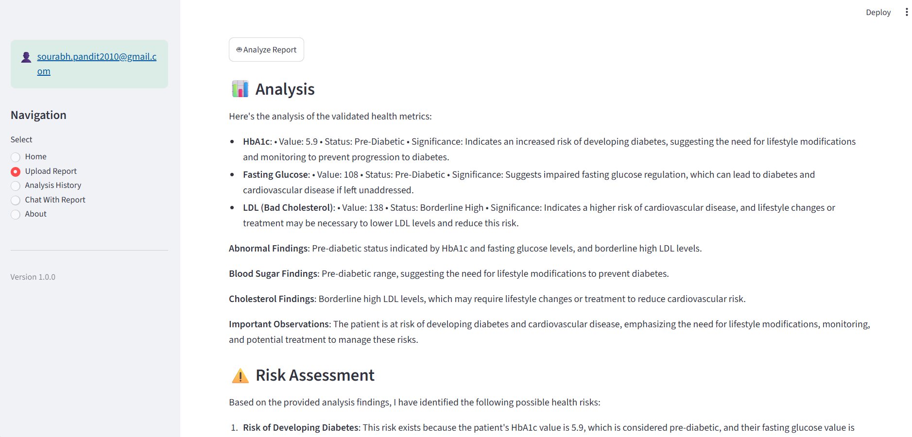
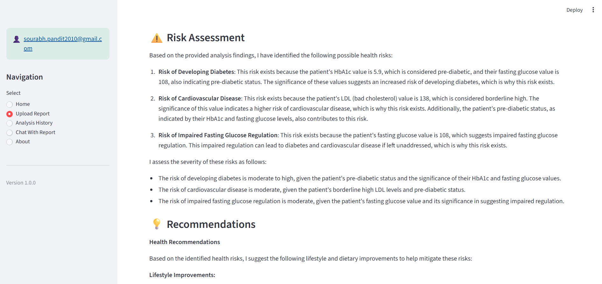
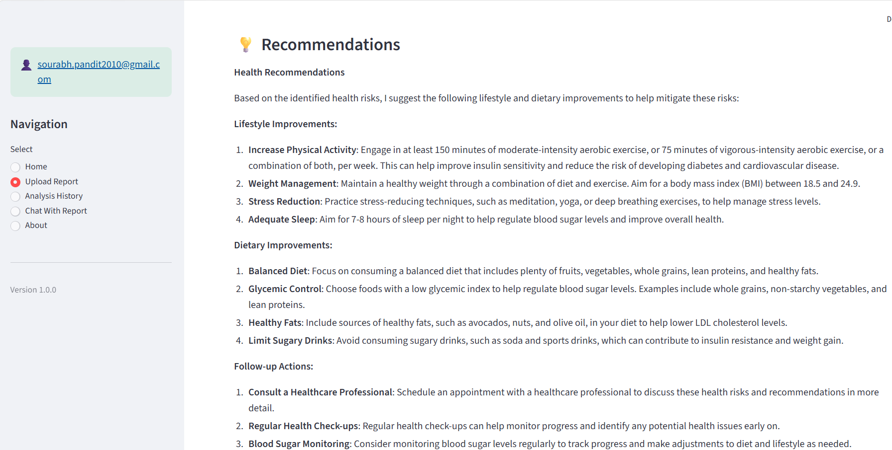
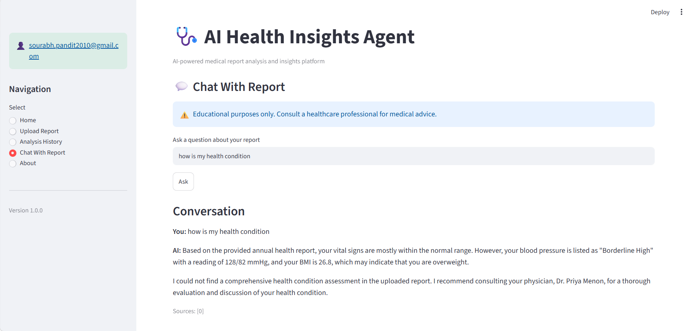

# 🏥 AI Health Insights Agent

An AI-powered healthcare report analysis platform that extracts medical metrics from uploaded health reports, validates them against trusted medical reference ranges, and generates AI-powered health insights using a multi-agent LangGraph workflow.

Supports:

👉 Health Report PDF Upload
👉 Medical Metric Extraction
👉 Golden Database Validation Engine
👉 AI Health Analysis
👉 Risk Assessment Agent
👉 Recommendation Agent
👉 Executive Summary Generation
👉 RAG-based Chat With Report
👉 FAISS Vector Search
👉 LangGraph Multi-Agent Workflow
👉 Streamlit Dashboard

---

# 📸 Demo Screenshots

### 🖥️ Health Report Upload



### 📊 Health Analysis Dashboard



### ⚠️ Risk Assessment



### 💡 Recommendations



### 💬 Chat With Report



---

# 📁 Project Structure

```text
AI-Health-Insights-Agent/

├── src/
│   ├── agents/
│   ├── components/
│   ├── services/
│   ├── workflows/
│   ├── skills/
│   ├── utils/
│   └── data/
│
├── screenshots/
│
├── README.md
├── ARCHITECTURE.md
└── FUTURE_ENHANCEMENTS.md
```

---

# 🚀 Features

* Upload Health Report PDFs
* PDF Text Extraction
* LangGraph Multi-Agent Workflow
* Medical Metric Extraction Agent
* Golden Validation Engine
* AI Health Analysis
* Health Risk Assessment
* Personalized Recommendations
* Executive Summary Generation
* RAG-based Question Answering
* FAISS Vector Search
* Source Citation Tracking
* Streamlit Dashboard

---

# ⚙️ Setup Instructions

## 1. Clone Repository

```bash
git clone https://github.com/Spandit11/AI-Health-Insights-Agent
cd AI-Health-Insights-Agent
```

## 2. Create Virtual Environment

```bash
python -m venv venv
```

## 3. Activate Environment

### Windows

```bash
venv\Scripts\activate
```

### Linux / Mac

```bash
source venv/bin/activate
```

## 4. Install Dependencies

```bash
pip install -r requirements.txt
```

---

# 💻 Run the Application

```bash
streamlit run src/main.py
```

---

# 🧠 AI Workflow

## Health Analysis Workflow

```text
PDF Upload
     ↓
Text Extraction
     ↓
Metric Extraction Agent
     ↓
Metrics JSON
     ↓
Golden Validation Engine
     ↓
Validated Metrics
     ↓
Analysis Agent
     ↓
Risk Assessment Agent
     ↓
Recommendation Agent
     ↓
Summary Agent
```

## Chat Workflow

```text
Health Report
      ↓
Text Chunking
      ↓
Embeddings
      ↓
FAISS Vector Store
      ↓
RAG Retrieval
      ↓
Chat Agent
      ↓
Answer + Source Chunks
```

---

# 🧪 Validated Scenarios

The following scenarios have been successfully validated:

✅ Health Report Upload

✅ PDF Text Extraction

✅ Metric Extraction Agent

✅ Golden Validation Engine

✅ Health Analysis

✅ Risk Assessment

✅ Recommendations

✅ Executive Summary

✅ Chat With Report

✅ Source Citation Tracking

---

# 🧠 Technologies Used

* Python
* Streamlit
* LangGraph
* LangChain
* FAISS
* Sentence Transformers
* OpenAI / Azure OpenAI
* Retrieval-Augmented Generation (RAG)
* Multi-Agent AI
* JSON Validation Engine

---

# 📈 Current Version

Version: 2.0

Status: Demo Ready

Implemented:

✅ Health Report Upload

✅ LangGraph Multi-Agent Workflow

✅ Golden Validation Engine

✅ AI Health Analysis

✅ Risk Assessment

✅ Recommendations

✅ Executive Summary

✅ RAG Chat Assistant

---

# 🔮 Future Enhancements

Refer to:

```text
FUTURE_ENHANCEMENTS.md
```

for detailed roadmap.

---

# 👨‍💻 Author

**Sourabh Pandit**

Generative AI • Agentic AI • Azure PaaS • Cloud-Native .NET Solutions

This project was developed as a practical Proof of Concept to explore Agentic AI, LangGraph workflows, RAG architecture, healthcare analytics, and enterprise AI design patterns.

### Connect

* LinkedIn: https://www.linkedin.com/in/sourabh-pandit-b2570212
* GitHub: https://github.com/Spandit11

### Project Focus Areas

* Agentic AI
* LangGraph
* Healthcare Analytics
* Retrieval-Augmented Generation (RAG)
* Golden Validation Engines
* AI Workflow Orchestration
* Azure AI Architecture